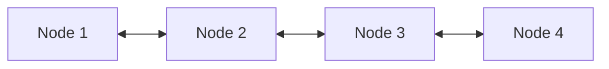
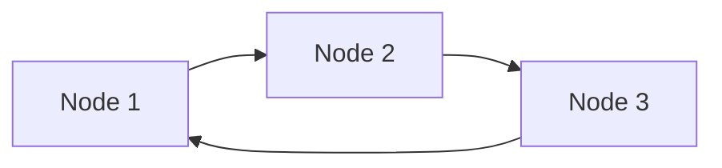

# 2.2 Danh sách liên kết (Linked List)

## 1. Khái niệm

* **Danh sách liên kết (Linked List)** là cấu trúc dữ liệu gồm các **node** nối với nhau bằng con trỏ (`next` hoặc `prev`).
* Mỗi **node** chứa:

  * **Dữ liệu (data)**
  * **Con trỏ (pointer)** trỏ tới node tiếp theo (hoặc trước đó trong danh sách đôi)

### Các loại danh sách liên kết:

1. **Đơn liên kết (Singly Linked List)**

   * Mỗi node chỉ trỏ tới node tiếp theo.
   * Duyệt từ đầu đến cuối.


2. **Đôi liên kết (Doubly Linked List)**

   * Mỗi node trỏ tới **next** và **prev**.
   * Duyệt cả hai chiều: tiến hoặc lùi.



3. **Danh sách vòng (Circular Linked List)**

   * Node cuối cùng trỏ về node đầu tiên.
   * Có thể là đơn hoặc đôi liên kết.



---

## 2. Ưu & Nhược điểm

| Loại     | Ưu điểm                                    | Nhược điểm                                       |
| -------- | ------------------------------------------ | ------------------------------------------------ |
| Singly   | Thêm/xóa đầu nhanh, linh hoạt              | Truy cập theo index chậm O(n), chỉ duyệt 1 chiều |
| Doubly   | Duyệt hai chiều, xóa node bất kỳ nhanh hơn | Tốn bộ nhớ thêm con trỏ `prev`                   |
| Circular | Duyệt liên tục, dùng cho queue/round-robin | Phức tạp hơn khi thêm/xóa                        |

---

## 3. Cài đặt trong Python

### 3.1 Node cơ bản

```python
class Node:
    def __init__(self, data):
        self.data = data
        self.next = None
```

### 3.2 Danh sách liên kết đơn

```python
class SinglyLinkedList:
    def __init__(self):
        self.head = None

    def insert_at_head(self, data):
        new_node = Node(data)
        new_node.next = self.head
        self.head = new_node

    def insert_at_tail(self, data):
        new_node = Node(data)
        if not self.head:
            self.head = new_node
            return
        current = self.head
        while current.next:
            current = current.next
        current.next = new_node

    def delete(self, key):
        current = self.head
        prev = None
        while current:
            if current.data == key:
                if prev:
                    prev.next = current.next
                else:
                    self.head = current.next
                return
            prev = current
            current = current.next

    def search(self, key):
        current = self.head
        while current:
            if current.data == key:
                return True
            current = current.next
        return False

    def print_list(self):
        current = self.head
        while current:
            print(current.data, end=" -> ")
            current = current.next
        print("None")
```

### 3.3 Ví dụ sử dụng

```python
ll = SinglyLinkedList()
ll.insert_at_head(3)
ll.insert_at_head(2)
ll.insert_at_tail(5)
ll.insert_at_tail(7)
ll.print_list()  # 2 -> 3 -> 5 -> 7 -> None

ll.delete(3)
ll.print_list()  # 2 -> 5 -> 7 -> None

print(ll.search(5))  # True
print(ll.search(10)) # False
```

---

## 4. Danh sách liên kết đôi

```python
class DoublyNode:
    def __init__(self, data):
        self.data = data
        self.prev = None
        self.next = None

class DoublyLinkedList:
    def __init__(self):
        self.head = None

    def insert_at_head(self, data):
        new_node = DoublyNode(data)
        new_node.next = self.head
        if self.head:
            self.head.prev = new_node
        self.head = new_node

    def insert_at_tail(self, data):
        new_node = DoublyNode(data)
        if not self.head:
            self.head = new_node
            return
        current = self.head
        while current.next:
            current = current.next
        current.next = new_node
        new_node.prev = current

    def print_forward(self):
        current = self.head
        while current:
            print(current.data, end=" <-> ")
            current = current.next
        print("None")
```

---

## 5. Bài tập luyện tập

1. **Chèn & Xóa**

   * Tạo danh sách liên kết đơn.
   * Thêm 5 node.
   * Xóa node đầu, node cuối và node ở giữa.
   * In danh sách sau mỗi thao tác.

2. **Tìm kiếm**

   * Viết hàm tìm node theo giá trị và trả về **vị trí (index)** trong danh sách.

3. **Đảo ngược danh sách liên kết đơn**

   * Viết hàm đảo ngược danh sách bằng Python mà không dùng list.
   * Gợi ý: thay đổi con trỏ `next` từng node.

4. **Chuyển danh sách đơn sang đôi**

   * Từ danh sách liên kết đơn đã tạo, viết hàm chuyển thành danh sách đôi, giữ thứ tự.

5. **Circular Linked List**

   * Tạo danh sách liên kết vòng gồm 5 node.
   * Viết hàm duyệt qua danh sách vòng, in 2 vòng liên tiếp.


