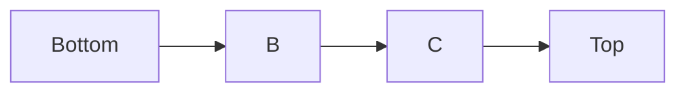
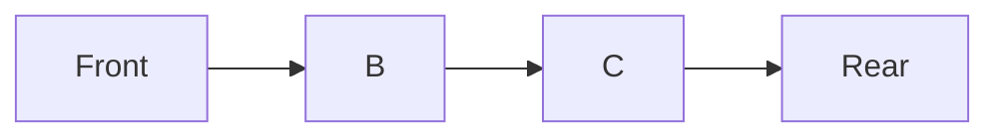

# 2.3 Ngăn xếp (Stack) & Hàng đợi (Queue)

## 1. Khái niệm

### 1.1 Ngăn xếp (Stack)

* Nguyên tắc: **LIFO (Last In, First Out)** – phần tử được thêm cuối cùng sẽ được lấy ra đầu tiên.
* Ứng dụng:

  * Kiểm tra dấu ngoặc trong biểu thức.
  * Lưu trạng thái trong thuật toán đệ quy.



* D: phần tử mới nhất (top), ra trước.

---

### 1.2 Hàng đợi (Queue)

* Nguyên tắc: **FIFO (First In, First Out)** – phần tử được thêm đầu tiên sẽ ra trước.
* Ứng dụng:

  * Quản lý luồng công việc (task scheduling).
  * Thuật toán BFS cơ bản trên đồ thị.



* A: phần tử vào trước, ra trước.
* D: phần tử mới nhất, ra sau.

---

## 2. Cài đặt trong Python

### 2.1 Stack bằng list

```python
stack = []

# Thêm phần tử (push)
stack.append(10)
stack.append(20)
stack.append(30)

# Lấy phần tử ra (pop)
print(stack.pop())  # 30
print(stack.pop())  # 20

# Xem phần tử trên cùng (peek)
print(stack[-1])    # 10
```

### 2.2 Stack bằng deque

```python
from collections import deque

stack = deque()
stack.append(10)
stack.append(20)
stack.append(30)

print(stack.pop())  # 30
```

---

### 2.3 Queue bằng deque

```python
from collections import deque

queue = deque()

# Thêm vào cuối (enqueue)
queue.append(1)
queue.append(2)
queue.append(3)

# Lấy ra từ đầu (dequeue)
print(queue.popleft())  # 1
print(queue.popleft())  # 2
```

### 2.4 BFS cơ bản bằng Queue

```python
from collections import deque

graph = {
    'A': ['B','C'],
    'B': ['D','E'],
    'C': ['F'],
    'D': [],
    'E': ['F'],
    'F': []
}

def bfs(start):
    visited = set()
    q = deque([start])
    while q:
        node = q.popleft()
        if node not in visited:
            print(node, end=" ")
            visited.add(node)
            q.extend(graph[node])

bfs('A')  # A B C D E F
```

---

### 2.5 Kiểm tra dấu ngoặc bằng Stack

```python
def is_valid_parentheses(s):
    stack = []
    mapping = {')':'(', '}':'{', ']':'['}
    for char in s:
        if char in mapping.values():
            stack.append(char)
        elif char in mapping.keys():
            if stack == [] or stack.pop() != mapping[char]:
                return False
    return stack == []

print(is_valid_parentheses("([]{})"))  # True
print(is_valid_parentheses("([)]"))    # False
```

---

## 3. Bài tập luyện tập

1. **Stack**

   * Viết hàm `reverse_string(s)` đảo ngược một chuỗi bằng stack.
   * Viết hàm kiểm tra biểu thức toán học, đảm bảo **dấu ngoặc (), {}, []** khớp.

2. **Queue**

   * Tạo hàng đợi bằng `deque`.
   * Thêm 5 phần tử, sau đó lấy ra 2 phần tử đầu.
   * In trạng thái hàng đợi sau mỗi thao tác.

3. **BFS nâng cao**

   * Viết thuật toán BFS in ra **các node theo từng mức (level)**.
   * Gợi ý: sử dụng queue và đếm số phần tử mỗi mức.

4. **Mô phỏng thực tế**

   * Giả lập **hàng đợi tại quầy tính tiền**:

     * Khách A, B, C xếp hàng.
     * Khách A thanh toán, rời đi.
     * Khách D đến xếp cuối.
   * In trạng thái hàng đợi sau từng bước.

