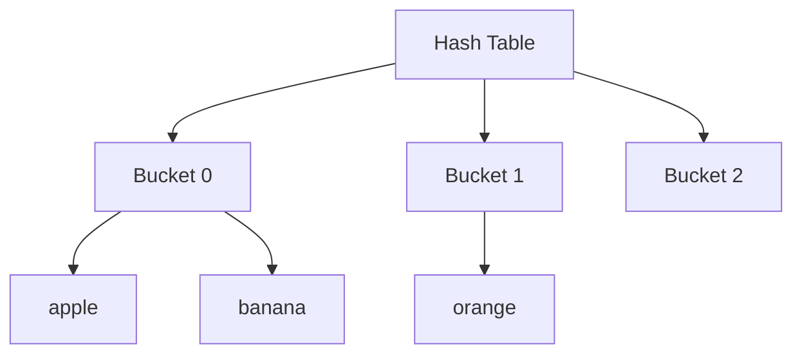
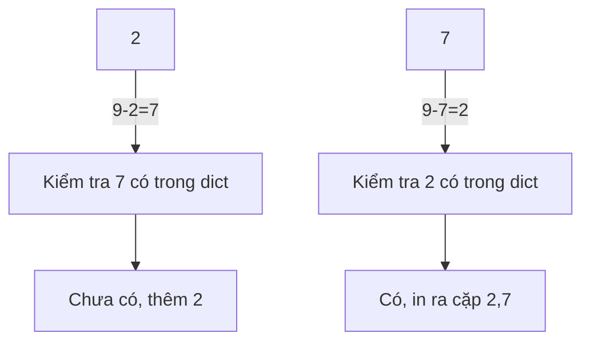

## 2.4 Bảng băm (Hash Table)

### 1. Khái niệm

**Bảng băm (Hash Table)** là cấu trúc dữ liệu lưu trữ các cặp **key-value** (khóa-giá trị) và cho phép **truy cập, thêm, xóa dữ liệu gần như ngay lập tức**.

* Key: duy nhất, dùng để định vị giá trị (value).
* Value: dữ liệu thực sự cần lưu.
* Hash function: hàm biến key thành chỉ số (index) trong bảng.

Trong Python, **dict** là cài đặt bảng băm tiêu chuẩn.

---

### 2. Hashing

**Hashing** là quá trình chuyển key thành một số nguyên (hash code), xác định vị trí lưu trữ trong bảng.

**Ví dụ:**

```python
hash("apple") % 10  # trả về vị trí từ 0-9
```

---

### 3. Xử lý va chạm (Collision)

Khi hai key khác nhau cùng hash ra một vị trí, xảy ra **va chạm**. Có 2 cách xử lý phổ biến:

1. **Chaining (xâu chuỗi)**: mỗi vị trí là một danh sách lưu tất cả key có cùng hash.
2. **Open Addressing (địa chỉ mở)**: tìm vị trí trống tiếp theo theo quy tắc.

Python **dict** tự xử lý va chạm bên trong nên chúng ta không cần tự triển khai.

---

### 4. Ví dụ sử dụng dict

#### a) Đếm tần suất xuất hiện

```python
words = ["apple", "banana", "apple", "orange", "banana", "apple"]
freq = {}

for w in words:
    freq[w] = freq.get(w, 0) + 1

print(freq)
# Output: {'apple': 3, 'banana': 2, 'orange': 1}
```

---

#### b) Tìm cặp có tổng bằng K

```python
arr = [2, 7, 11, 15]
K = 9
seen = {}

for num in arr:
    target = K - num
    if target in seen:
        print(f"Cặp tìm thấy: ({target}, {num})")
    seen[num] = True
```

---

### 5. Sơ đồ minh họa (Mermaid)

#### a) Cấu trúc Hash Table



#### b) Tìm cặp tổng bằng K



---

### 6. Bài tập vận dụng

1. **Đếm số lần xuất hiện của từng ký tự trong một chuỗi.**

   * Input: `"hashing"`
   * Output dự kiến: `{'h':2, 'a':1, 's':1, 'i':1, 'n':1, 'g':1}`

2. **Kiểm tra xem một danh sách có cặp số nào tổng bằng K không.**

   * Input: `arr = [1, 4, 5, 3], K = 8`
   * Output dự kiến: `(5,3)`

3. **Tìm các phần tử xuất hiện nhiều hơn 1 lần trong danh sách.**

   * Input: `[1,2,3,2,4,1]`
   * Output dự kiến: `[1,2]`

4. **(Nâng cao)** Viết chương trình cho phép người dùng nhập một danh sách số và K, in tất cả cặp số có tổng bằng K.

