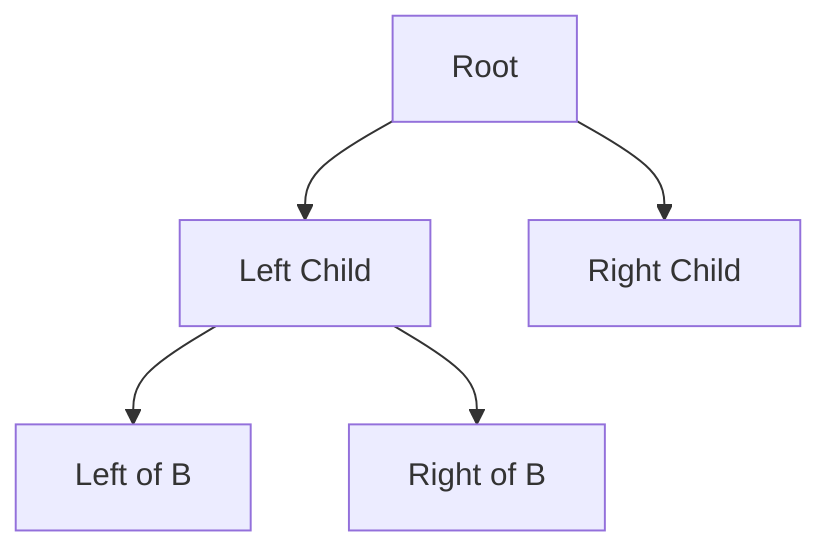
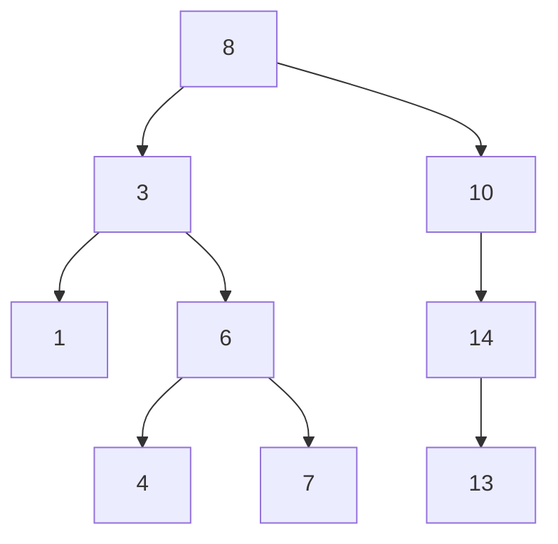
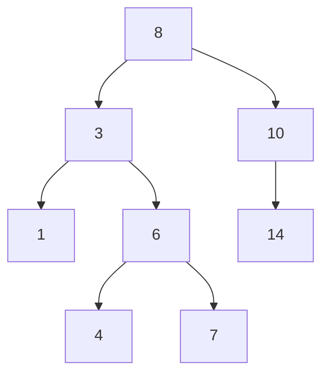
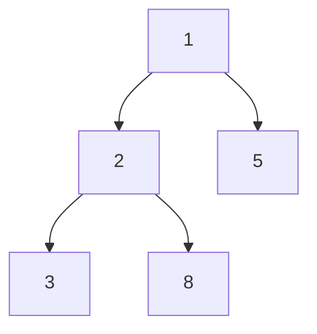

## 2.5 Cây (Trees) & Heaps

### 1. Khái niệm Cây (Tree)

**Cây** là cấu trúc dữ liệu dạng **bậc cao** gồm các **node** kết nối với nhau theo quan hệ **cha-con**.

* **Node**: phần tử trong cây.
* **Root**: nút gốc, đầu tiên của cây.
* **Leaf**: nút lá, không có con.
* **Edge**: đường nối giữa các nút.

#### a) Cây nhị phân (Binary Tree)

Mỗi node có tối đa **2 con**: left child và right child.



#### b) Cây tìm kiếm nhị phân (Binary Search Tree - BST)

* **Điều kiện**: với mỗi node `N`,

  * Các giá trị ở **bên trái** < N
  * Các giá trị ở **bên phải** > N

**Ví dụ:**



#### c) Cài đặt BST cơ bản trong Python

```python
class Node:
    def __init__(self, key):
        self.key = key
        self.left = None
        self.right = None

def insert(root, key):
    if root is None:
        return Node(key)
    if key < root.key:
        root.left = insert(root.left, key)
    else:
        root.right = insert(root.right, key)
    return root

# Tạo BST
root = Node(8)
insert(root, 3)
insert(root, 10)
insert(root, 6)
insert(root, 14)
```

---

### 2. Heap

**Heap** là dạng cây **hoàn chỉnh** (complete binary tree) dùng để **ưu tiên truy xuất phần tử lớn nhất hoặc nhỏ nhất**.

* **Min-Heap**: phần tử nhỏ nhất ở root.
* **Max-Heap**: phần tử lớn nhất ở root.
* Python cung cấp module **heapq**, hỗ trợ min-heap.

#### a) Min-Heap với heapq

```python
import heapq

arr = [5, 3, 8, 1, 2]
heapq.heapify(arr)  # Biến arr thành min-heap
print(arr)  # [1, 2, 8, 5, 3]

heapq.heappush(arr, 0)  # Thêm 0
print(arr)  # [0, 1, 8, 5, 3, 2]

min_val = heapq.heappop(arr)  # Lấy ra phần tử nhỏ nhất
print(min_val)  # 0
```

#### b) Max-Heap bằng cách đảo dấu

```python
arr = [5, 3, 8, 1, 2]
max_heap = [-x for x in arr]
heapq.heapify(max_heap)

max_val = -heapq.heappop(max_heap)
print(max_val)  # 8
```

---

### 3. Sơ đồ minh họa (Mermaid)

#### a) BST



#### b) Min-Heap



---

### 4. Bài tập vận dụng

1. **Tạo BST** từ danh sách `[15, 10, 20, 8, 12, 16, 25]` và in theo thứ tự **in-order**.
2. **Tìm giá trị lớn nhất và nhỏ nhất trong BST.**
3. **Sử dụng heapq**, tạo min-heap từ `[9, 4, 7, 1, 6]`, thêm số 0 và in heap.
4. **Viết hàm kiểm tra** một danh sách có phải là max-heap hay không.
5. **(Nâng cao)** Viết chương trình **BST -> heap**: chuyển BST sang min-heap.

