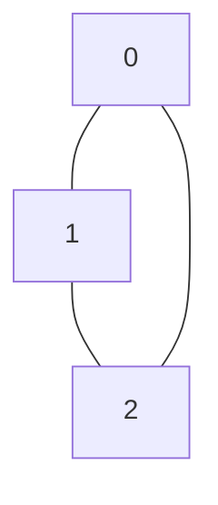
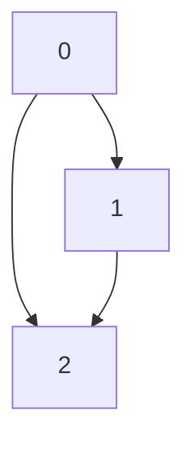
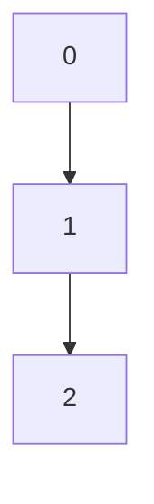

## 2.6 Đồ thị (Graph)

### 1. Khái niệm đồ thị

**Đồ thị (Graph)** là cấu trúc dữ liệu gồm tập các **đỉnh (vertices, nodes)** và tập các **cạnh (edges)** nối các đỉnh với nhau.

* **Vô hướng (Undirected Graph)**: cạnh không có hướng, đi từ A→B cũng là B→A.
* **Có hướng (Directed Graph)**: cạnh có hướng, đi từ A→B chỉ có một chiều.

---

### 2. Cách lưu đồ thị

#### a) Ma trận kề (Adjacency Matrix)

* Ma trận 2 chiều `VxV` với `V` là số đỉnh.
* `matrix[i][j] = 1` nếu có cạnh từ i→j, ngược lại = 0.

```python
# Đồ thị vô hướng với 3 đỉnh
V = 3
matrix = [[0]*V for _ in range(V)]
matrix[0][1] = 1
matrix[1][0] = 1
matrix[1][2] = 1
matrix[2][1] = 1
print(matrix)
```

#### b) Danh sách kề (Adjacency List)

* Mỗi đỉnh lưu danh sách các đỉnh kề.
* Dễ mở rộng, tiết kiệm bộ nhớ với đồ thị thưa.

```python
graph = {
    0: [1],
    1: [0, 2],
    2: [1]
}
```

---

### 3. Duyệt đồ thị

#### a) BFS (Breadth-First Search)

* Duyệt theo **mức (level)**, dùng **queue**.
* Tốt để tìm **đường đi ngắn nhất** trong đồ thị vô hướng không trọng số.

```python
from collections import deque

def bfs(graph, start):
    visited = set()
    q = deque([start])
    while q:
        node = q.popleft()
        if node not in visited:
            print(node, end=' ')
            visited.add(node)
            q.extend([n for n in graph[node] if n not in visited])

graph = {0:[1,2], 1:[0,2], 2:[0,1]}
bfs(graph, 0)  # Output: 0 1 2
```

#### b) DFS (Depth-First Search)

* Duyệt theo **chiều sâu**, dùng **stack** hoặc **đệ quy**.
* Thường dùng để kiểm tra **chu trình, thành phần liên thông**.

```python
def dfs(graph, node, visited=None):
    if visited is None:
        visited = set()
    visited.add(node)
    print(node, end=' ')
    for neighbor in graph[node]:
        if neighbor not in visited:
            dfs(graph, neighbor, visited)

dfs(graph, 0)  # Output: 0 1 2
```

---

### 4. Ví dụ ứng dụng

#### a) Tìm đường đi giữa 2 đỉnh

```python
def find_path_bfs(graph, start, goal):
    from collections import deque
    queue = deque([(start, [start])])
    while queue:
        vertex, path = queue.popleft()
        for neighbor in graph[vertex]:
            if neighbor == goal:
                return path + [goal]
            else:
                queue.append((neighbor, path + [neighbor]))

graph = {0:[1,2], 1:[0,2], 2:[0,1,3], 3:[2]}
print(find_path_bfs(graph, 0, 3))  # [0, 2, 3]
```

#### b) Kiểm tra chu trình (DFS)

```python
def has_cycle(graph, node, visited=None, parent=None):
    if visited is None:
        visited = set()
    visited.add(node)
    for neighbor in graph[node]:
        if neighbor not in visited:
            if has_cycle(graph, neighbor, visited, node):
                return True
        elif parent != neighbor:
            return True
    return False

graph = {0:[1,2], 1:[0,2], 2:[0,1]}
print(has_cycle(graph, 0))  # True
```

---

### 5. Sơ đồ minh họa (Mermaid)

#### a) Đồ thị vô hướng



#### b) BFS từ đỉnh 0



#### c) DFS từ đỉnh 0



---

### 6. Bài tập vận dụng

1. **Tạo đồ thị vô hướng** với các cạnh `[(0,1),(0,2),(1,2),(2,3)]` dưới dạng danh sách kề và ma trận kề.
2. **Duyệt BFS và DFS** từ đỉnh 0 và in thứ tự đỉnh được duyệt.
3. **Tìm đường đi ngắn nhất** từ đỉnh 0 đến 3 bằng BFS.
4. **Kiểm tra chu trình** trong đồ thị trên.
5. **(Nâng cao)** Viết hàm chuyển đồ thị từ danh sách kề sang ma trận kề và ngược lại.

