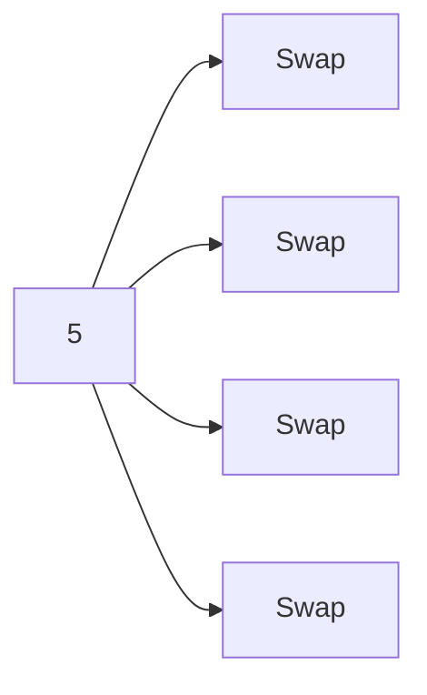

## **Bài 3.2: Sắp xếp (Sorting)**

### 1. Bubble Sort

* So sánh từng cặp phần tử liền nhau, **đẩy giá trị lớn nhất về cuối**.

```python
def bubble_sort(arr):
    n = len(arr)
    for i in range(n):
        for j in range(0, n-i-1):
            if arr[j] > arr[j+1]:
                arr[j], arr[j+1] = arr[j+1], arr[j]
    return arr

arr = [5,3,2,4,1]
print(bubble_sort(arr))
```

**Mermaid minh họa Bubble Sort**



---

### 2. Insertion Sort

* Chia danh sách thành **đã sắp xếp** và **chưa sắp xếp**, chèn phần tử vào vị trí đúng.

```python
def insertion_sort(arr):
    for i in range(1, len(arr)):
        key = arr[i]
        j = i-1
        while j>=0 and key < arr[j]:
            arr[j+1] = arr[j]
            j -= 1
        arr[j+1] = key
    return arr

arr = [5,3,2,4,1]
print(insertion_sort(arr))
```

---

### 3. Selection Sort

* Tìm **giá trị nhỏ nhất** trong phần chưa sắp xếp, đổi chỗ với đầu phần chưa sắp xếp.

```python
def selection_sort(arr):
    n = len(arr)
    for i in range(n):
        min_idx = i
        for j in range(i+1, n):
            if arr[j] < arr[min_idx]:
                min_idx = j
        arr[i], arr[min_idx] = arr[min_idx], arr[i]
    return arr

arr = [5,3,2,4,1]
print(selection_sort(arr))
```

---

### 4. Merge Sort

* **Chia để trị**: chia danh sách thành 2 nửa, sắp xếp từng nửa, gộp lại.

```python
def merge_sort(arr):
    if len(arr) <= 1:
        return arr
    mid = len(arr)//2
    left = merge_sort(arr[:mid])
    right = merge_sort(arr[mid:])
    return merge(left, right)

def merge(left, right):
    result = []
    i=j=0
    while i<len(left) and j<len(right):
        if left[i]<right[j]:
            result.append(left[i])
            i+=1
        else:
            result.append(right[j])
            j+=1
    result.extend(left[i:])
    result.extend(right[j:])
    return result

arr = [5,3,2,4,1]
print(merge_sort(arr))
```

---

### 5. Quick Sort

* Chọn **pivot**, chia thành danh sách nhỏ hơn và lớn hơn, sắp xếp đệ quy.

```python
def quick_sort(arr):
    if len(arr) <= 1:
        return arr
    pivot = arr[0]
    less = [x for x in arr[1:] if x <= pivot]
    greater = [x for x in arr[1:] if x > pivot]
    return quick_sort(less) + [pivot] + quick_sort(greater)

arr = [5,3,2,4,1]
print(quick_sort(arr))
```

---

### 6. Heap Sort

* Sử dụng **heap** để trích phần tử nhỏ nhất/lớn nhất.

```python
import heapq

def heap_sort(arr):
    heapq.heapify(arr)
    return [heapq.heappop(arr) for _ in range(len(arr))]

arr = [5,3,2,4,1]
print(heap_sort(arr))
```

---

### **Bài tập sắp xếp**

1. Sắp xếp danh sách `[9,4,7,1,6]` bằng Bubble, Insertion, Selection, Merge, Quick và Heap Sort.
2. So sánh số lần so sánh và độ phức tạp giữa Bubble Sort và Merge Sort trên danh sách 10 phần tử.
3. Tìm số lớn thứ 3 trong danh sách `[7,2,5,3,9,1]` bằng thuật toán sắp xếp.
4. Viết hàm sắp xếp giảm dần bằng Quick Sort.


