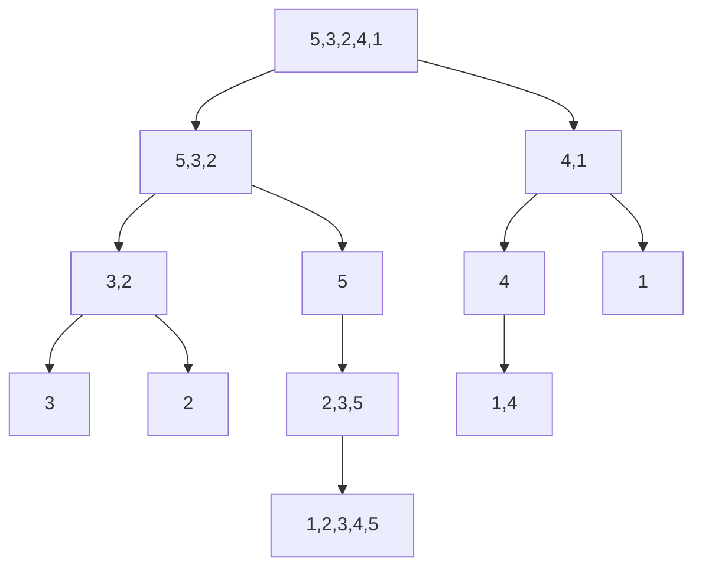

## **3.3 Kỹ thuật Chia để trị (Divide & Conquer)**

### 1. Khái niệm

**Chia để trị (Divide & Conquer)** là kỹ thuật giải quyết vấn đề bằng cách:

1. **Chia (Divide)**: chia bài toán lớn thành các bài toán con nhỏ hơn cùng loại.
2. **Chinh phục (Conquer)**: giải quyết các bài toán con này (thường đệ quy).
3. **Kết hợp (Combine)**: ghép kết quả từ các bài toán con lại để tạo kết quả bài toán gốc.

**Ưu điểm:**

* Giảm độ phức tạp tính toán từ `O(n^2)` xuống `O(n log n)` trong nhiều thuật toán.
* Dễ áp dụng với bài toán đệ quy và các cấu trúc dữ liệu phân chia được.

---

### 2. Ví dụ ứng dụng

#### a) Merge Sort

* **Chia**: tách danh sách làm 2 nửa.
* **Chinh phục**: sắp xếp từng nửa (đệ quy).
* **Kết hợp**: gộp 2 nửa đã sắp xếp thành danh sách mới.

```python
def merge_sort(arr):
    if len(arr) <= 1:
        return arr
    mid = len(arr)//2
    left = merge_sort(arr[:mid])
    right = merge_sort(arr[mid:])
    return merge(left, right)

def merge(left, right):
    result = []
    i=j=0
    while i<len(left) and j<len(right):
        if left[i]<right[j]:
            result.append(left[i])
            i+=1
        else:
            result.append(right[j])
            j+=1
    result.extend(left[i:])
    result.extend(right[j:])
    return result

arr = [5,3,2,4,1]
print(merge_sort(arr))  # [1,2,3,4,5]
```

**Mermaid minh họa Merge Sort**



---

#### b) Quick Sort

* **Chia**: chọn 1 phần tử làm pivot, phân loại danh sách nhỏ hơn và lớn hơn pivot.
* **Chinh phục**: sắp xếp 2 danh sách con đệ quy.
* **Kết hợp**: ghép danh sách nhỏ hơn + pivot + danh sách lớn hơn.

```python
def quick_sort(arr):
    if len(arr) <= 1:
        return arr
    pivot = arr[0]
    less = [x for x in arr[1:] if x <= pivot]
    greater = [x for x in arr[1:] if x > pivot]
    return quick_sort(less) + [pivot] + quick_sort(greater)

arr = [5,3,2,4,1]
print(quick_sort(arr))  # [1,2,3,4,5]
```

**Mermaid minh họa Quick Sort**

```mermaid
graph TD
    A[5,3,2,4,1] --> B[Pivot=5, less=[3,2,4], greater=[ ]]
    B --> C[Quick sort less=[3,2,4]]
    C --> D[Pivot=3, less=[2], greater=[4]]
    D --> E[Sort less=[2]]
    D --> F[Sort greater=[4]]
    E --> G[Combine: 2,3,4]
    G --> H[Combine: 2,3,4,5]
```

---

#### c) Tìm giá trị lớn nhất trong một phân đoạn

* **Chia**: chia mảng thành 2 nửa.
* **Chinh phục**: tìm max trong từng nửa.
* **Kết hợp**: chọn giá trị lớn nhất giữa 2 nửa.

```python
def max_divide_conquer(arr):
    if len(arr) == 1:
        return arr[0]
    mid = len(arr)//2
    left_max = max_divide_conquer(arr[:mid])
    right_max = max_divide_conquer(arr[mid:])
    return max(left_max, right_max)

arr = [5,3,2,4,1]
print(max_divide_conquer(arr))  # 5
```

**Mermaid minh họa Tìm Maximum**

```mermaid
graph TD
    A[5,3,2,4,1] --> B[5,3,2]
    A --> C[4,1]
    B --> D[5]
    B --> E[3,2]
    E --> F[3]
    E --> G[2]
    C --> H[4]
    C --> I[1]
    D --> J[5]
    F --> K[3]
    G --> L[2]
    H --> M[4]
    I --> N[1]
    J --> O[5]
    K --> P[3]
    L --> Q[2]
    M --> R[4]
    N --> S[1]
    O --> T[Compare max(5,3)=5]
    T --> U[Compare max(5,2)=5]
    U --> V[Compare max(5,4)=5]
    V --> W[Compare max(5,1)=5]
```

---

### 3. Bài tập vận dụng

1. Viết hàm **Merge Sort** sắp xếp danh sách `[9,4,7,1,6]`.
2. Viết hàm **Quick Sort** sắp xếp danh sách `[8,3,5,2,7]`.
3. Viết hàm **tìm maximum** trong mảng `[12,5,7,9,20,3]` bằng kỹ thuật chia để trị.
4. So sánh số bước thực hiện giữa Merge Sort và Bubble Sort trên danh sách 8 phần tử.
5. (Nâng cao) Viết hàm **tìm minimum và maximum cùng lúc** trong một mảng bằng Divide & Conquer.

